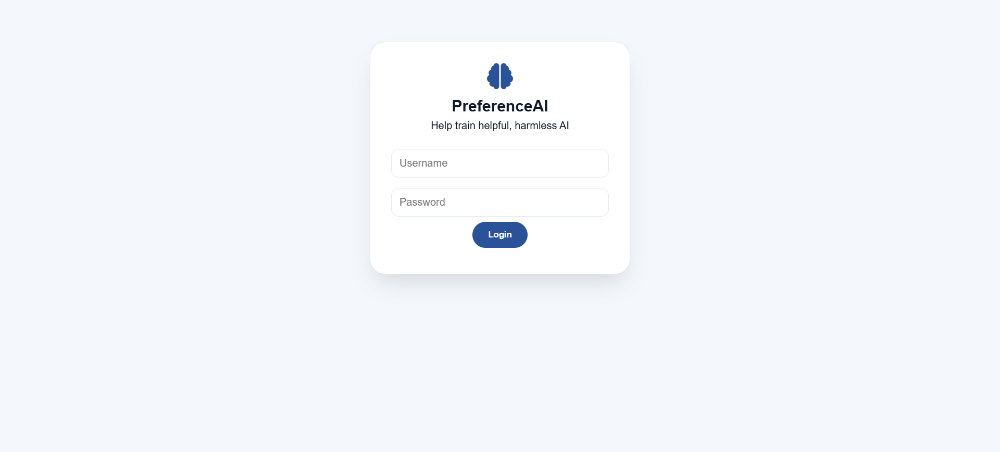
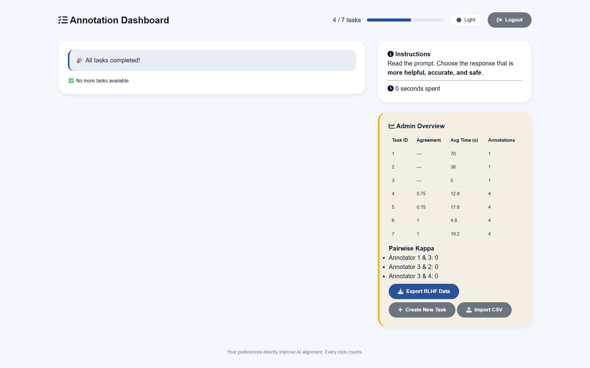
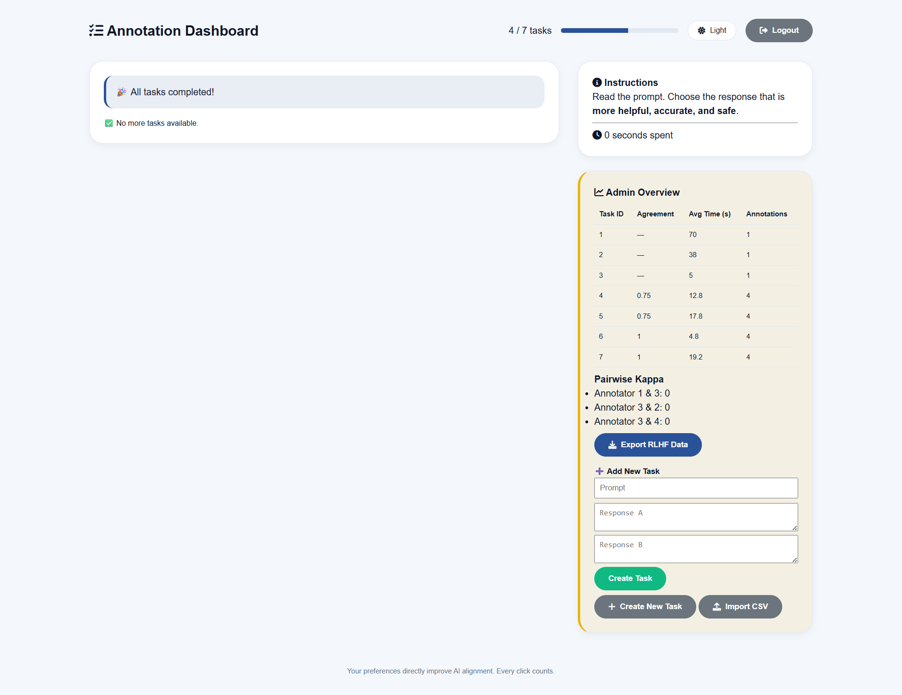
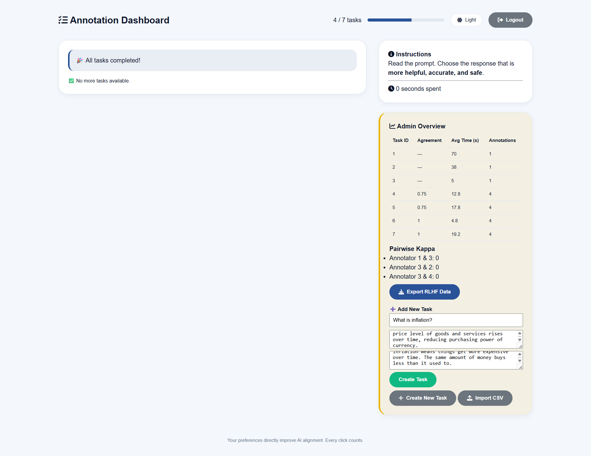
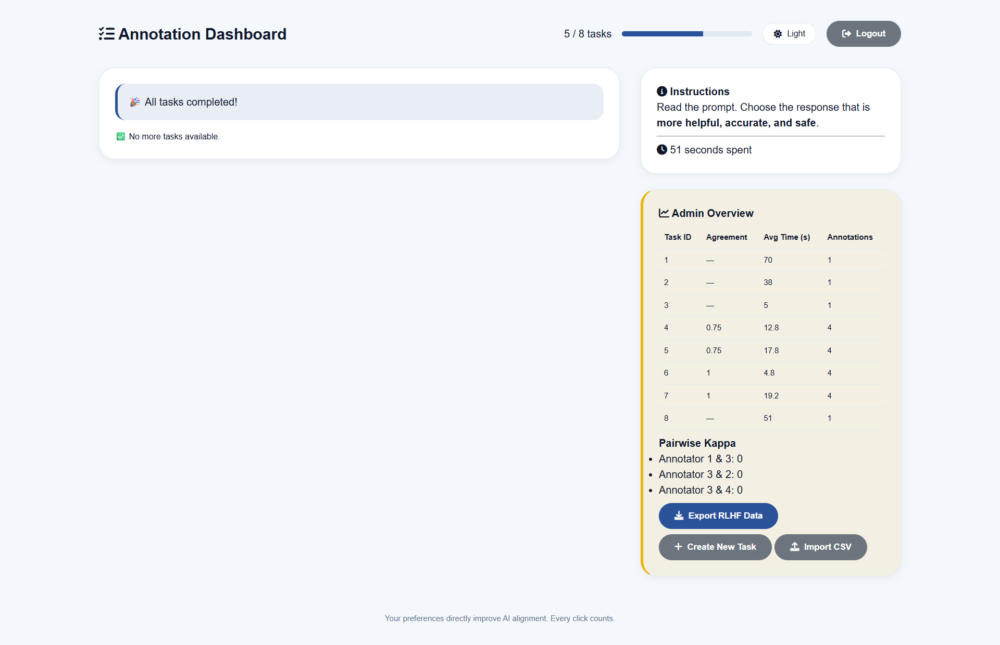
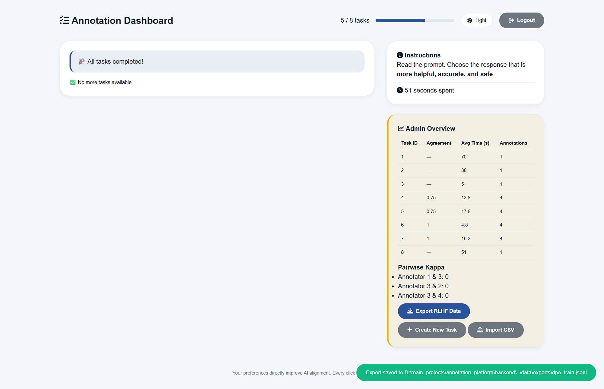

# PreferenceAI - RLHF/DPO Annotation Platform


> A self-hosted, open-source web platform for collecting human preference data (RLHF/DPO).
> Annotators compare two AI responses to a prompt, and the platform exports `dpo_train.jsonl` -
> ready for fine-tuning large language models like Llama, Mistral, or Zephyr.

**Built: August 2025 – June 2026** &nbsp;|&nbsp; A genuine, long-term effort to make preference annotation affordable, transparent, and focused.

---

## Screenshots

| Login | Annotator Dashboard |
|-------|---------------------|
|  |  |

| Task Creation | Prompt & Responses |
|---------------|--------------------|
|  |  |

| Task Completion | RLHF Data Export |
|-----------------|------------------|
|  |  |

---

## Why This Exists

When experimenting with RLHF for an in-house AI assistant, we hit three barriers:

- No open-source tool produced the exact DPO format (`{prompt, chosen, rejected}`) out of the box.
- Commercial platforms (Scale AI, Labelbox) charge per annotation and require data to leave your infrastructure.
- We wanted full ownership of the dataset, annotator management, and workflow.

So we built **PreferenceAI** - a lightweight, focused tool that does one thing well: collect pairwise preferences and export them for DPO training.

---

## Features

- **Username/password login** - Django session auth with superuser admin flag
- **Smart task queue** - assigns the task with the fewest existing annotations first, ensuring annotator overlap
- **Preference ranking** - click the better of two responses; checkmark confirms selection
- **Time tracking** - records time spent per task for quality filtering
- **Admin dashboard** - per-task percent agreement, average annotation time, annotation count, and pairwise Cohen's kappa between every annotator pair
- **One-click export** - downloads `dpo_train.jsonl` in standard DPO format
- **CSV bulk import** - upload hundreds of tasks at once (`prompt`, `response_a`, `response_b`)
- **Dark mode** - toggleable, preference remembered across sessions
- **CSRF protection** - secure POST requests via Django's built-in CSRF middleware

---

## How It Works

```
Annotator logs in
      ↓
GET /api/next-task/
  → exclude tasks already annotated by this user
  → pick task with lowest annotation count  ← ensures overlap
      ↓
Annotator selects the better response
      ↓
POST /api/submit-annotation/
  → saves choice + time spent
      ↓
Admin views /api/stats/
  → percent agreement, avg time, pairwise Cohen's kappa
      ↓
Admin clicks Export RLHF Data
  → downloads dpo_train.jsonl
```

**Export format** (one JSON object per line):
```json
{"prompt": "Explain gravity.", "chosen": "Gravity is a force...", "rejected": "Things fall down."}
```

---

## Comparison with Market Tools

| Feature | Label Studio | Argilla | Prodigy | Scale AI | PreferenceAI |
|---------|:---:|:---:|:---:|:---:|:---:|
| Open source | ✅ | ✅ | ❌ | ❌ | ✅ |
| DPO `.jsonl` export (native, one-click) | ❌ | ✅ | ✅ | ✅ | ✅ |
| Zero-config setup | ❌ | ❌ | ❌ | ❌ | ✅ |
| Task prioritisation (least-annotated first) | ❌ | ❌ | ❌ | ✅ | ✅ |
| Pairwise Cohen's kappa | ❌ | ✅ | ✅ | ✅ | ✅ |
| Real authentication | ✅ | ✅ | ✅ | ✅ | ✅ |
| CSV bulk import | ✅ | ✅ | limited | ✅ | ✅ |
| Self-hosted / data stays local | ✅ | ✅ | partial | ❌ | ✅ |
| Cost | $0 | $0 | $490+/mo | $$$$ | $0 |

**Key difference:** PreferenceAI trades generality for extreme focus. It does one thing - collect pairwise preferences - and does it with the lowest setup friction of any tool in this space.

---

## Tech Stack

| Layer | Technology |
|-------|------------|
| Backend | Django 5.0, Django REST Framework |
| Database | SQLite (dev) / PostgreSQL (prod) |
| Frontend | HTML5, CSS3, vanilla JavaScript |
| Authentication | `django.contrib.auth` (session-based) |
| Agreement metrics | scikit-learn (percent agreement + Cohen's kappa) |
| Export | JSONL - `dpo_train.jsonl` |

---

## Project Structure

```
preferenceai/
├── backend/
│   ├── annotation/               # main Django app
│   │   ├── models.py
│   │   ├── views.py
│   │   ├── urls.py
│   │   ├── utils.py
│   │   ├── serializers.py
│   │   └── templates/
│   │       └── login.html
│   ├── annotation_platform/      # project settings
│   ├── manage.py
│   └── requirements.txt
├── frontend/
│   └── index.html                # single-page UI (dark mode, responsive)
├── data/
│   └── exports/                  # dpo_train.jsonl written here
├── screenshots/
└── README.md
```

---

## Setup & Installation

### Prerequisites

- Python 3.10+
- pip

### Install

```bash
git clone https://github.com/yourusername/preferenceai.git
cd preferenceai/backend
python -m venv venv

# Windows
venv\Scripts\activate
# macOS / Linux
source venv/bin/activate

pip install -r requirements.txt
```

### Database & Users

```bash
python manage.py makemigrations
python manage.py migrate

# Create admin (superuser)
python manage.py createsuperuser
```

To create annotator accounts quickly:

```bash
python manage.py shell
>>> from annotation.models import User, Annotator
>>> for i in range(1, 4):
...     user, _ = User.objects.get_or_create(username=f"annotator{i}", defaults={"password": "pass"})
...     Annotator.objects.get_or_create(user=user)
>>> exit()
```

### Run

```bash
python manage.py runserver
```

Open `http://localhost:8000` - you'll see the login page.

---

## First Use (Admin Workflow)

1. Log in with your superuser credentials.
2. Click **Create New Task** to add tasks one by one, or **Import CSV** to upload many at once.
   - CSV format: `prompt`, `response_a`, `response_b` (header row required).
3. Share annotator usernames with your team. They log in and start annotating immediately.
4. Monitor progress in the **Admin Overview** panel (agreement %, avg time, kappa).
5. Click **Export RLHF Data** to download `dpo_train.jsonl` when ready.

---

## Real-World Use Cases

- **Fine-tuning chatbots** - collect human preferences on helpfulness, safety, and conciseness
- **Aligning base models** - prepare preference data for DPO (used by Meta, Mistral, HuggingFace)
- **A/B testing model outputs** - quickly compare two generation strategies across human judges
- **Academic research** - generate RLHF datasets without expensive commercial tooling

---

## Development Timeline

| Period | What happened |
|--------|---------------|
| Aug 2025 | Terminal script - two responses shown in the console, user types a choice |
| Sep 2025 | First Django app - single `Task` model, raw HTML frontend |
| Oct 2025 | Added `Assignment` and `Annotation` models - tasks were still exclusive (no overlap) |
| Nov–Dec 2025 | Paused. Realised exclusive task assignment makes inter-annotator agreement impossible |
| Jan 2026 | Redesigned assignment logic - exclude only tasks *this user* already annotated |
| Feb 2026 | Added task prioritisation (least-annotated first). Basic admin stats |
| Mar 2026 | Added export endpoint. Fixed output from JSON array → JSONL |
| Apr 2026 | Modernised UI - glassmorphism cards, checkmarks, progress bar |
| May 2026 | Switched to percent agreement (temporary). Added numeric ID validation |
| Jun 2026 | Full auth (username/password, sessions), CSV import, pairwise Cohen's kappa, dark mode, CSRF fixes, responsive design. Project complete |

---

## Challenges & How We Solved Them

**Tasks annotated by only one person**
The assignment logic excluded any task with an existing assignment - even incomplete ones. Fixed by excluding only tasks the *current user* had already submitted an annotation for.

**Kappa was always `None`**
Without overlap between annotators, kappa can't be calculated. Fixed with task prioritisation (fewest annotations first), which naturally forces overlap.

**No admin visibility**
Built `/api/stats/` returning per-annotator progress, per-task metrics, and pairwise kappa for every annotator pair.

**Numeric ID login - insecure**
Anyone could type `1` and get admin access. Replaced with Django's full `contrib.auth` - username/password, sessions, superuser flag.

**CSRF 403 errors on POST**
Added `/api/csrf/` to set the cookie, and frontend reads `getCookie('csrftoken')` on every POST.

**Manual task creation too slow**
CSV import endpoint (`/api/import-csv/`) - admin uploads a file, hundreds of tasks created in seconds.

**Percent agreement too simplistic**
Added pairwise Cohen's kappa via `sklearn.metrics.cohen_kappa_score` across all tasks both annotators completed.

---

## Current Limitations & Roadmap

| Limitation | Planned improvement |
|------------|---------------------|
| No task edit / delete | Admin interface for task management |
| Single task type (preference ranking) | Add text classification, image preference |
| No email verification | Optional email verification for production |
| CSV import only | Add JSON and Parquet import |
| No REST API tokens | Token authentication for external automation |
| No real-time charts | Live agreement visualisation in admin panel |

---

## License

© 2026 Mouli Sagar – All rights reserved.

Built August 2025 – June 2026.
